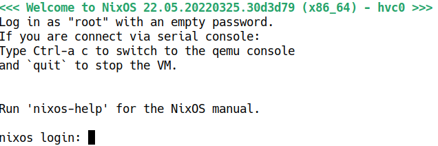

# Install Cicero

## How to install Cicero locally

### Clone repository locally

```
git clone https://github.com/input-output-hk/cicero.git
```

### Fix for Local paths

For local paths to work in Cicero it's necessary to add the following line to nixos/configs/vm.nix
Afterwards the Qemu VM and Cicero need to be restarted.

```
   nix = {
     package = pkgs.nix_2_5;
	 ...
   };
```

### Provide github token with read:org, repo flags

```
cat >> ~/.netrc << EOF
machine github.com
login github_username
password github_token

machine api.github.com
login github_username
password github_token
EOF
```

### Enter the Cicero development shell
```
nix develop
```

### Start a development Qemu VM with Nomad, nomad-follower, Vault and Spongix:
```
nixos-shell --flake .
```
At this point a login prompt should show up:


Login as 'root' to continue.

### Open another terminal and run Cicero outside the VM:
```
nix develop
dev-cicero --web-listen :8000
```

### Cicero's WebUI should now be available on [http://localhost:8000](http://localhost:8000).
